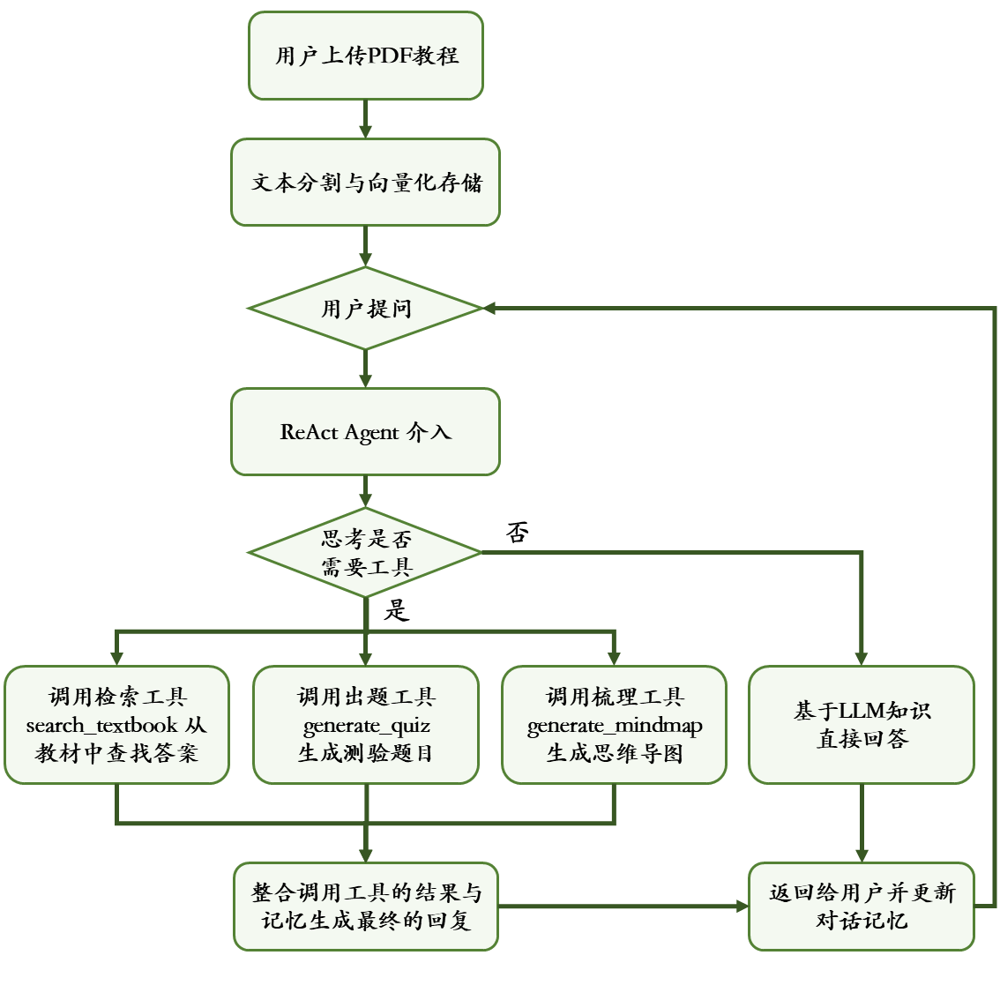

# 📚 易学 - 新一代智能学习伙伴 (YiXue）

[](https://langchain.com/)
[](https://gradio.app/)
[](https://www.python.org/)

“易学”是一个基于LangGraph的AI智能体，旨在成为您专属的、具备深度思考与长期记忆能力的“学习教练”。它不仅是一个聊天机器人，更是一个能自主理解教材、生成测验、绘制知识图谱的主动式学习伙伴。

<div align="center">
  
  <br/>
  <small><i>🎬 功能演示动图</i></small>
</div>

## 🎯 项目动机 | Why YiXue?

在传统教育模式中，学生常常面临教材内容晦涩、知识点孤立、复习缺乏系统性与趣味性等痛点。现有工具多为被动式问答，难以提供结构化、主动性的学习辅助。

**“易学”​ 应运而生，旨在解决以下核心问题：**

**知识内化难：** 将厚厚的PDF教材转化为可交互、可查询的“活知识库”。

**复习效率低：** 自动生成针对性的测验题目与思维导图，变“盲目复习”为“精准训练”。

**互动性不足：** 模拟人类“思考-行动-观察”的ReAct推理过程，进行有逻辑、有记忆的深层对话。

**工具碎片化：** 集成“检索-问答-出题-导图”于一体，在一个界面内完成学习的完整闭环。

**产品愿景：** 从“被动答疑”的工具，升级为“主动规划、深度陪伴、助力内化”的智能学习伙伴。

## ✨ 核心功能 | What Can It Do?

1. **📄 智能教材处理与检索**
   - 上传任何大学课程的PDF教材，自动进行分块、向量化处理。
   - 基于语义（而非关键词）在教材中进行高精度、多片段的相关内容检索。
2. **🤔 具备“思考链”的深度对话**
   - 基于**LangGraph ReAct Agent**框架，AI会像人类一样“先思考，再行动”。
   - 在对话中自主判断何时检索教材、何时生成题目、何时构建知识图谱。
   - **具备会话记忆**，能记住整个对话上下文，实现连贯、深入的知识探讨。
3. **🧠 一键生成知识思维导图**
   - 输入任一主题（如“傅里叶变换”），自动生成结构清晰、带emoji的Markdown格式思维导图大纲，帮助快速构建知识体系。
4. **✍️ 智能测验生成与解析**
   - 输入知识点，自动生成5道高质量复习题（3单选+2简答）。
   - 题目包含正确答案与详细解析，简答题提供评分要点，是考前复习的利器。

------

## 🚀 快速开始 | Get Started in 5 Minutes

### 第0步：环境准备

确保你的系统已安装 **Python 3.10+** 和 **Git**。

### 第1步：获取代码

```
git clone https://github.com/WillingXu1/YiXue-smart-learning-partner.git
cd YiXue-smart-learning-partner-main
```


### 第2步：创建并激活虚拟环境（推荐）

```python
python -m venv agent_py  # 创建环境，最后一个指的是环境名
source agent_py/bin/activate  #激活环境
```


### 第3步：安装项目依赖

项目根目录下已提供 `requirements.txt`文件，一键安装所有必要库。

```python
pip install -r requirements.txt
```


### 第4步：配置 API 密钥

你需要一个 **智谱AI** 的API Key。

1. 前往 [智谱AI开放平台](https://open.bigmodel.cn/) 注册并获取 API Key。 
2. 在项目根目录下，复制环境变量示例文件并填入你的密钥：


### 第5步：启动智能学习伙伴！

运行主程序，它将自动初始化AI模型并启动Web界面。

```python
cd src
python agent_app.py
```


### 第6步：开始学习之旅！

在终端看到 `Running on local URL: http://0.0.0.0:7860`后，用浏览器打开这个链接。


#### **使用流程**：

1. **上传**：在Web界面中上传你的PDF教材。
2. **构建**：点击“上传并构建知识库”，等待处理完成。
3. **对话**：在下方输入框开始提问！例如：“请解释一下第二章的核心概念”或“给我出5道关于‘矩阵运算’的题目”。
4. **探索**：尝试让AI生成思维导图或进行多轮深入对话。


## 🔄 核心工作流程 | How It Works

<div style="display: flex; flex-wrap: wrap;">
    
</div>


## ⚙️ 配置说明 | Configuration

- **模型**：默认使用智谱AI `glm-4.7`模型，可在 `init_ai()`函数中更换。
- **向量数据库**：使用轻量级 `FAISS`进行本地向量存储与检索。
- **记忆系统**：使用 LangGraph 的 `MemorySaver`，实现线程级的对话记忆。
- **界面**：基于 `Gradio`构建，美观且无需前端知识即可自定义。


## 📁 项目结构 | Project Structure

```
YiXue-smart-learning-partner-main/
├── requirements.txt      # Python依赖包列表
├── .env                  # 环境变量文件（需自行创建，存放API KEY）
├── README.md             # 本项目说明文档
└── src
    ├── agent_app.py      # 主程序入口，包含所有核心逻辑
    ├── agents/           # 智能体定义模块 （后续整理扩展）
    └── chains/           # 处理链模块    （后续整理扩展）
```


## 🛠 技术栈 | Tech Stack

- **AI 框架**: [LangGraph](https://langchain.com/langgraph)(构建具备记忆与工具调用能力的智能体)
- **大语言模型**: [智谱AI](https://open.bigmodel.cn/) GLM-4.7
- **向量化与检索**: [ZhipuAI Embeddings](https://open.bigmodel.cn/)+ [FAISS](https://faiss.ai/)
- **文档处理**: [LangChain Document Loaders & Text Splitters](https://docs.langchain.com/oss/python/langchain/overview)
- **Web UI**: [Gradio](https://docs.langchain.com/oss/python/langchain/overview)
- **环境管理**: `python-dotenv`

------

## 📄 开源许可 | License

本项目采用 MIT 许可证。详见 `LICENSE`文件。

------

## ✨ 未来愿景

“易学”是探索AI Agent在教育领域应用的起点。我们期待它未来能够：

- 支持更多格式的文档（Word, PPT, 网页）。
- 接入多模态模型，处理教材中的图表与公式。
- 实现基于知识掌握程度的个性化学习路径规划。
- 开放插件系统，集成更多学习工具（如Anki卡片生成）。

如有问题，可以有些邮箱联系我，也可以进行交流，项目不足之处，还请多多担待。

> **作者**: zxs
> **邮箱**: 2571293150@qq.com  
> **GitHub**: [[YiXue](https://github.com/WillingXu1/YiXue-smart-learning-partner.git)]